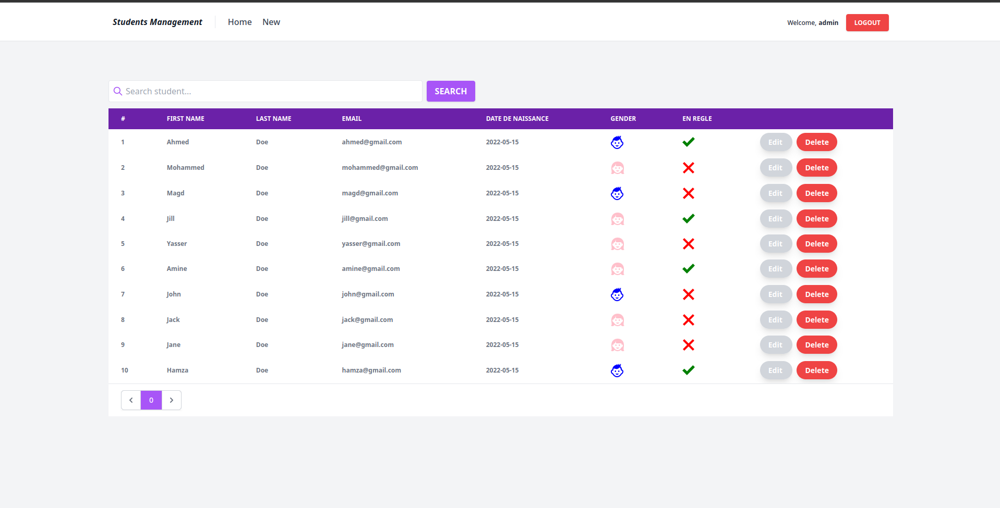

## Students Management using Spring Framework

##### 1. Create a new Spring Boot project

- Use the following command to create a new Spring Boot project<br>
    ```
    $ mvn archetype:generate -DgroupId=ma.janah -DartifactId=students-management -Dversion=1.0-SNAPSHOT -DarchetypeArtifactId=maven-archetype-quickstart -DinteractiveMode=false
    ```
- Using Graphical Interface:<br>


##### 2. Entities:

- **Student**:
    - **id**: String (primary key)
    - **firstName**: String
    - **lastName**: String
    - **email**: String
    - **dateOfBirth**: DATE
    - **gender**: <i>**GenderType**</i>
    - **enRegle**: Boolean


- **GenderType**:


##### 3. Repositories:
- **StudentRepository**:


##### 4. Services:
- **IStudentService**:
    <br>
    
    <br>
- **StudentServiceImpl**:
    <br>
    
    <br>

##### 5. Controllers:
- **StudentController**:
    <br>
    
    
    
    <br>

##### 6. Templates:
- **baseTemplate.html**:
    <br>
    
    <br>
- **index.html**:
    <br>
    
    <br>
- **delete student using HTTP DELETE**:
    <br>
    
    <br>
- **other templates**:
    <br>
    
    <br>

##### 6. Spring Security:
- Using **UserDetails** Strategy:
    ##### 6.1 Entities:
    - **AppUser**:
        - **userId**: String (primary key)
        - **username**: String
        - **password**: String
        - **active**: Boolean
        - **roles**: List<AppRole>
    <br>
    
    - **AppRole**:
        - **roleId**: Long (primary key)
        - **roleName**: String
        - **description**: String
    <br>
    
    <br>
    ##### 6.2 Repositories:
    - **AppUserRepository**:
          <br>
          
          <br>
    - **AppRoleRepository**:
          <br>
          
          <br>
    ##### 6.3 Services:
    - **ISecurityService**:
          <br>
          
          <br>
    - **SecurityServiceImpl**:
          <br>
          
          <br>
    ##### 6.4 UserDetailsService:
    - **UserDetailsServiceImpl**:
          <br>
          
          <br>
    ##### 6.5 SecurityConfig:
    - **Enabling Method Security**:
        <br>
        
        <br>
    - **Secure Each Route**:
      `@PreAuthorize("hasAuthority('ADMIN')")`
      <br>
      
      <br>
    - **Security Configuration**:
      <br>
      
      <br>

##### 7. Spring Application:
- **application.properties**:
    <br>
    
    <br>
- **create start function to add some data**:
    <br>
    
    <br>
- **database**:
    <br>
    
    <br>

##### 8. Other Functionalities:
- custom **Exception Handler**:
    <br>
    
    <br>
- custom **login page**:
    <br>
    
    <br>
    
    <br>
- custom **logout**:
    <br>
    
    <br>
- update **security config**
    <br>
    
    <br>

##### 9. Screenshots:

<br>

<br>

<br>

<br>