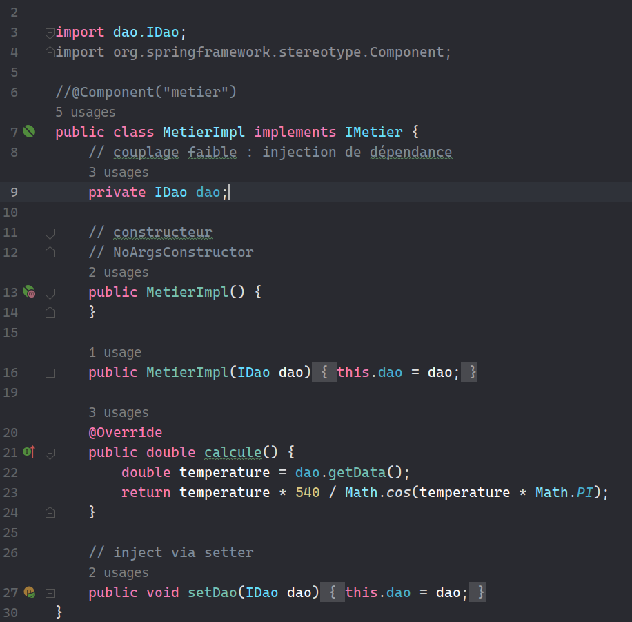

# TP1: dependency injection

- different methods for injecting dependencies.
    - static injection.
    - dynamic injection.
    - using the Spring Framework:
     - XML Version
     - Annotation Version
---

#### 1. create IDAO interface

#### 2. create IDAO implementation

#### 3. create IMetier interface

#### 4. create IMetier implementation

#### 5. Dependency Injection

- 5.1 Static Injection:
    - instantiate every class manually.
  
  
- 5.2 Dynamic Injection:
- - create a config file.
  
- - create a class that will be used to inject the dependencies.
  
  
- 5.3 Using the Spring Framework:
  - 5.3.1 XML Version:
   - create `applicationContext.xml` file.
        
    
     
   - create a class that will be used to inject the dependencies.
    
    
    
  - 5.3.2 Annotation Version:
  - create new Dao implementation decorated `@Component`.
       
  
   
  - create new Metier implementation decorated `@Component`.
       
  
  - create class that will be used to inject the dependencies.
       
  
  
