#### TP2: Cas de Patient, Medecin, Rendez-vous, Consultation

##### 1. Entities:

- **Patient**:
    - **id**: id du patient
    - **nom**: nom du patient
    - **dateNaissance**: date de naissance du patient
    - **adresse**: adresse du patient
    - **malade**: booléen qui indique si le patient est malade
    - **Collection de Rendez-Vous**: collection de rendez-vous du patient
 
 
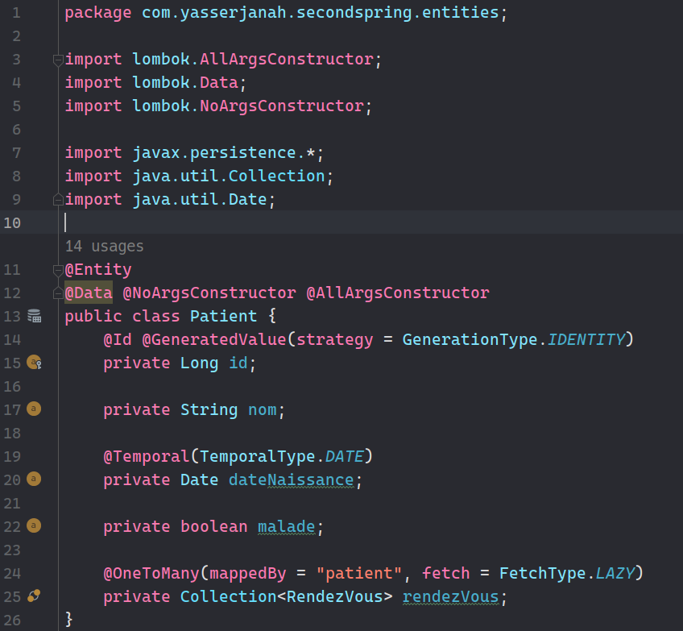
 
 
  
- **Medecin**:
    - **id**: id du medecin
    - **nom**: nom du medecin
    - **email**: email du medecin
    - **specialite**: specialité du medecin
    - **Collection de Rendez-Vous**: collection de rendez-vous du medecin
 
 
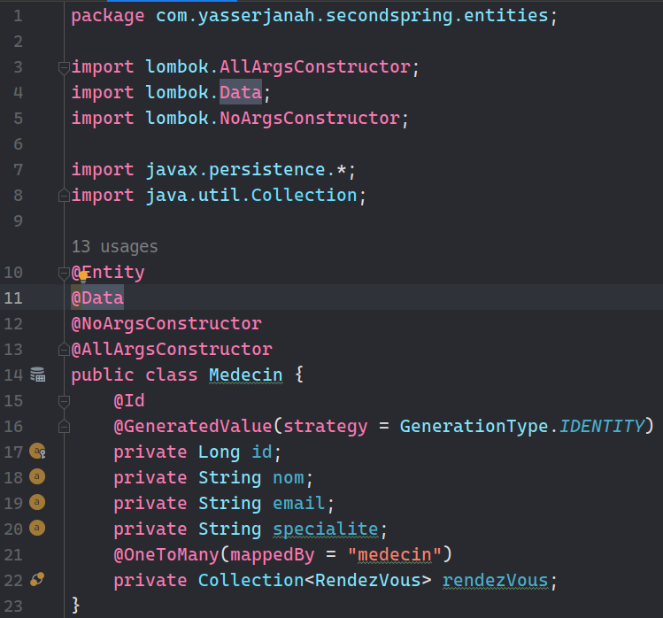
 
 
  
- **Rendez-Vous**:
    - **id**: id du rendez-vous
    - **date**: date du rendez-vous
    - **status**: status du rendez-vous
    - **patient**: patient du rendez-vous
    - **medecin**: medecin du rendez-vous
    - **consultation**: consultation du rendez-vous
 
 
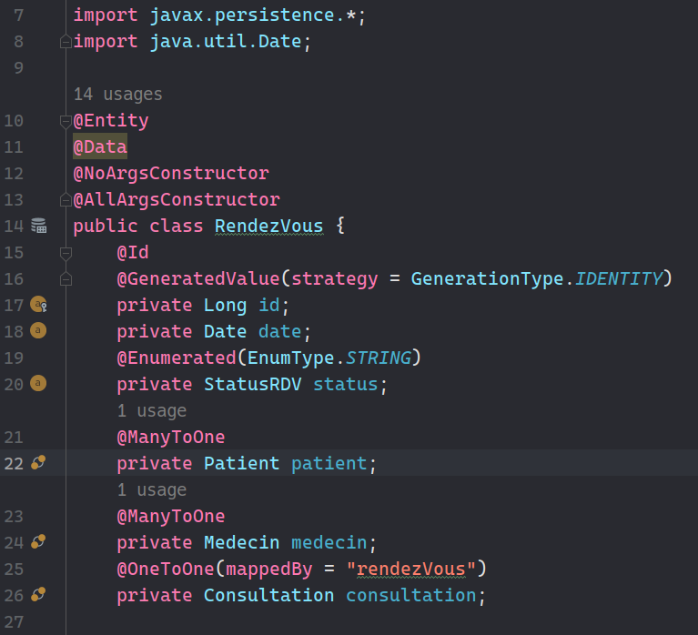
 
 
  
- **Consultation**:
    - **id**: id de la consultation
    - **dateConsulation**: date de la consultation
    - **rapportConsulation**: rapport de la consultation
    - **rendezVous**: rendez-vous de la consultation
 
 
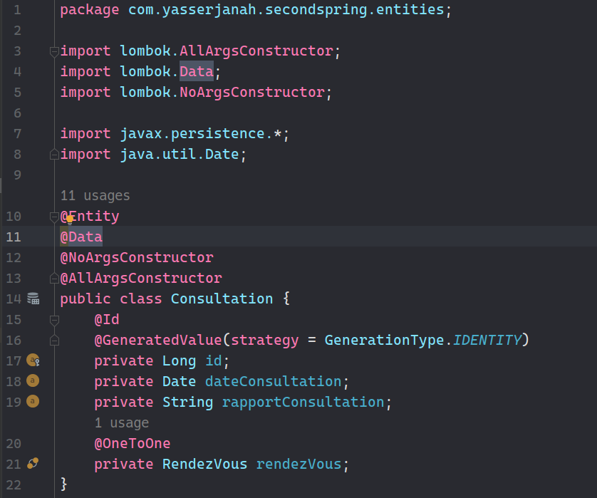
 
 

##### 2. Repositories:
- **PatientRepository**:
     
    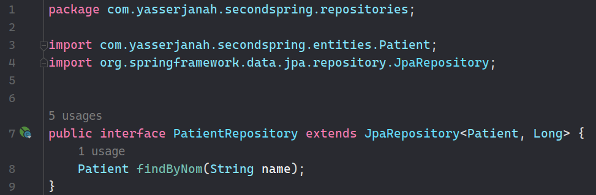
     
- **MedecinRepository**:
     
    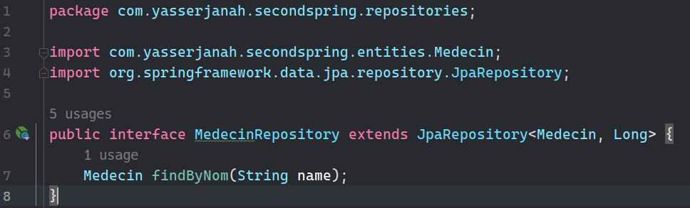
     
- **RendezVousRepository**:
     
    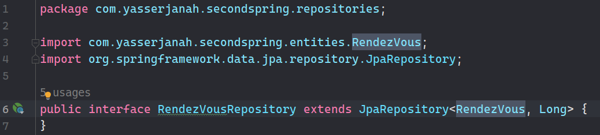
     
- **ConsultationRepository**:
     
    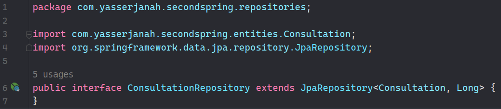
     

##### 3. Services:
- **IHospitalService**:
     
    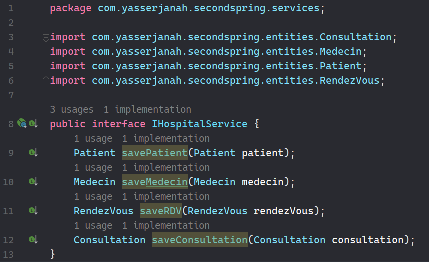
     
- **IHospitalServiceImpl**:
     
    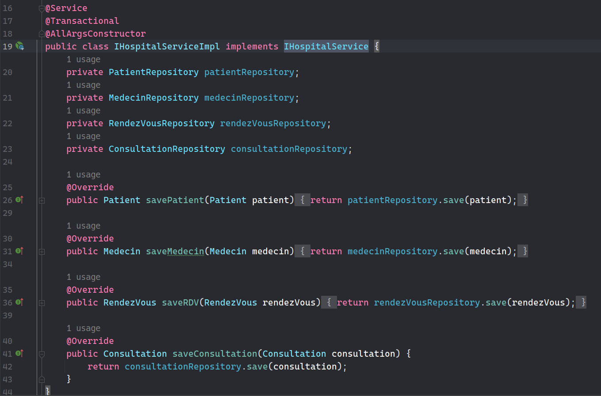
     

##### 4. Spring Application:
- **application.properties**:
     
    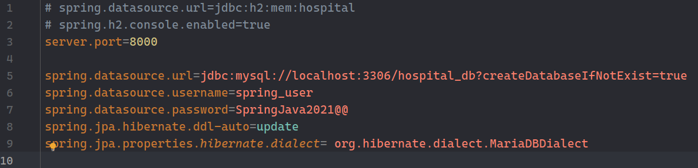
     
- **run application**:
     
    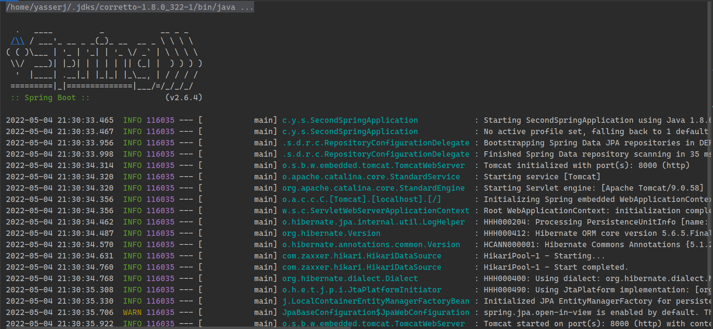
     
- **insert some data**:
     
    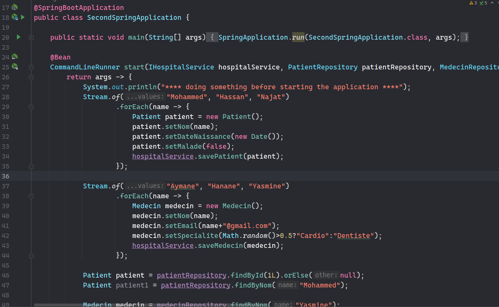
     
- **Verify the existence of data**:
     
    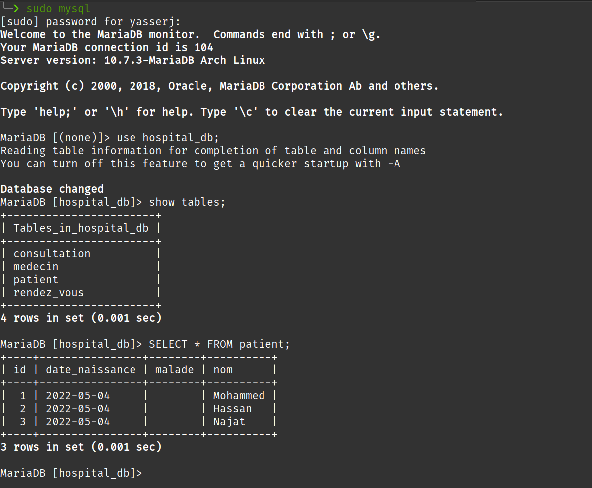
     
- **Create a Web Controller**:
     
    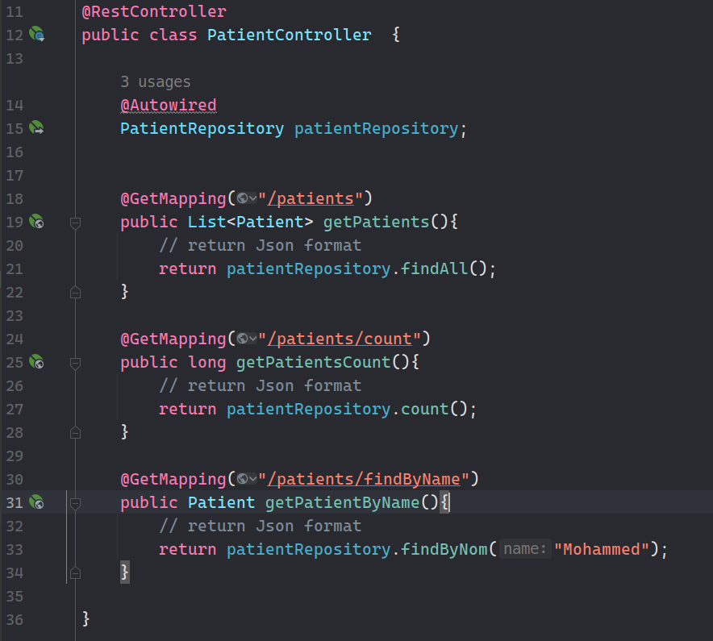
     
- **consulting `http://localhost:8080/api/patients`**:
     
    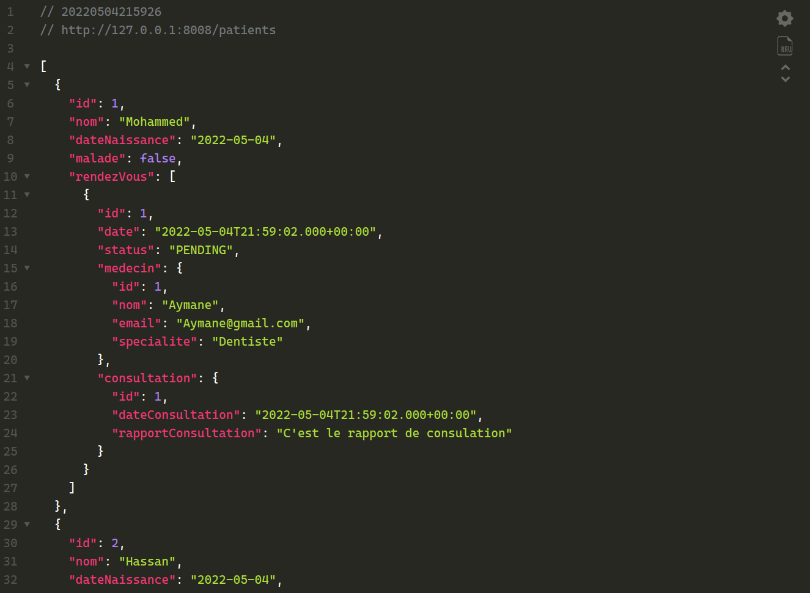
     
