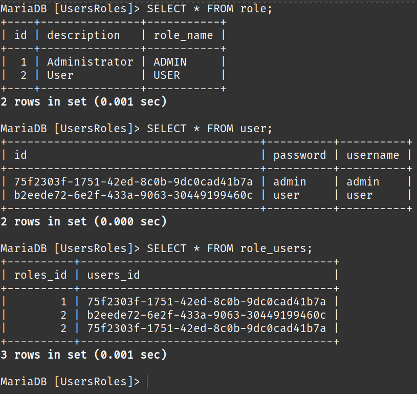

#### TP2: Cas de Users et Roles

##### 1. Entities:

- **User**:
  - **id**: `int`
  - **username**: `string`
  - **password**: `string`
  - **roles**: `List<Role>`
 

 
- **Role**:
  - **id**: `int`
  - **roleName**: `String`
  - **description**: `String`
  - **users**: `List<User>`
 

 

##### 2. Repositories:
- **UserRepository**:
     
    
     
- **RoleRepository**:
     
    
     

##### 3. Services:
- **IUserService**:
     
    
     
- **UserServiceImpl**:
     
    
    
    
     

##### 4. Controllers:
- **UserController**:
     
    
     

##### 5. Spring Application:
- **application.properties**:
     
    
     

- **insert some data**:
     
    
     
- **Verify the existence of data**:
     
    
     
- **consulting `http://localhost:8080/users`**:
     
    
     
- **consulting `http://localhost:8080/users/admin`**:
     
    
     
- authenticate `http://localhost:8080/users/authenticate`:
     
    
     
