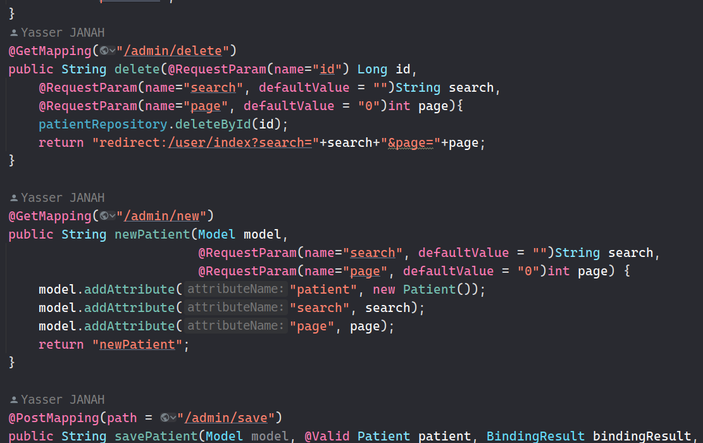
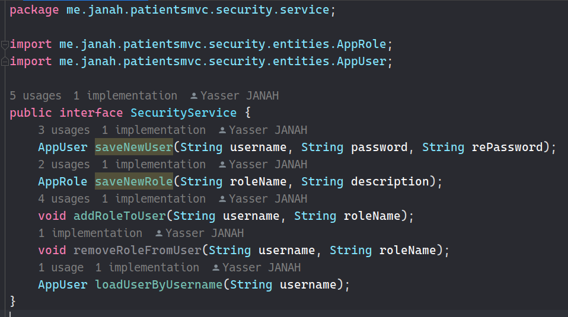

#### TP3: Patients Management using Spring MVC & Thymeleaf

##### 1. Entities:

- **Patient**:
  - **id**: `Long`
  - **nom**: `String`
  - **dateNaissance**: `Date`
  - **malade**: `boolean`
  - **score**: `int`
 

 

##### 2. Repositories:
- **PatientRepository**:
     
    
     

##### 3. Controllers:
- **PatientController**:
     
    
    
     

##### 4. Templates:
- **baseTemplate.html**:
     
    
     
- **patients.html**:
     
    
     
- **other templates**:
     
    
     

### 5. Spring Security:

- Using **UserDetails** Strategy:
  #### 5.1 Entities:
    - **AppUser**:
        - **userId**: String (primary key)
        - **username**: String
        - **password**: String
        - **active**: Boolean
        - **roles**: List of <i>**Role**</i>
     
    
     
      
    - **AppRole**:
        - **roleId**: Long (primary key)
        - **roleName**: String
        - **description**: String
     
    
     
      
  #### 5.2 Repositories:
    - **AppUserRepository**:
       
      
       
  
    - **AppRoleRepository**:
       
      
       
  
  #### 5.3 Services:
    - **ISecurityService**:
       
      
       
  
    - **SecurityServiceImpl**:
       
      
       
  
  #### 5.4 UserDetailsService:
    - **UserDetailsServiceImpl**:
       
      
       
  
  #### 5.5 SecurityConfig:
 - **Security Configuration**:
       
      
       

##### 6. Spring Application:
- **application.properties**:
     
    
     

- **insert some data**:
     
    
     
- **Verify the existence of data**:
     
    
     

##### 7. Screenshots:

